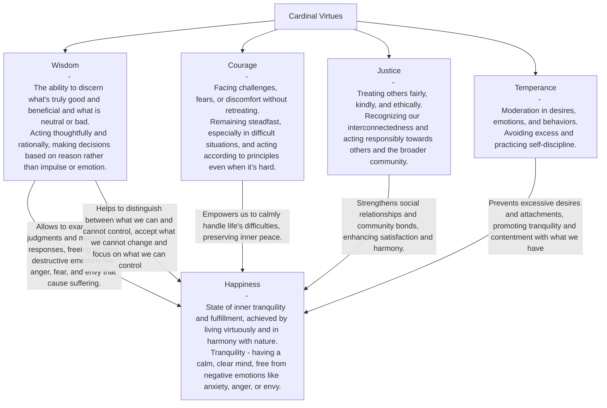
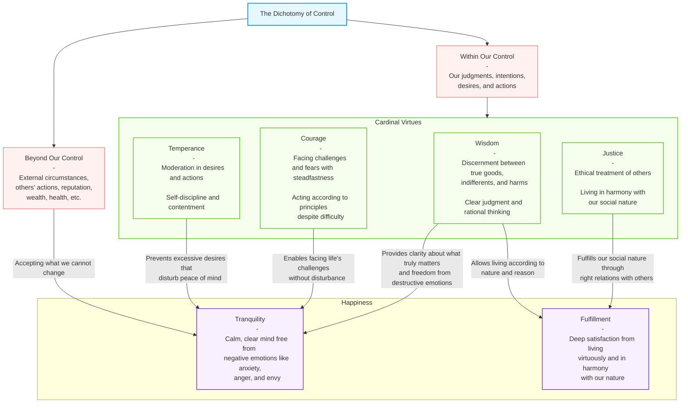

Stoic philosophy is to heal misconceptions about what truly matters. This healing allows us to stop chasing external goods that don't bring lasting happiness and instead focus on internal growth that cannot be taken away. External circumstances (wealth, health, reputation) are largely beyond our control and inherently unstable. Basing happiness on these factors makes it fragile and temporary.

Character, is something we can develop regardless of circumstances. When you develop wisdom, courage, justice, and moderation, you carry the source of your well-being with you at all times, making you resilient to fortune's changes.
Stoics saw humans as naturally rational and social beings. By developing our character in accordance with these aspects of our nature through rational thinking and ethical behavior, we fulfill our purpose and function well as humans, which brings satisfaction.

Diagram below illustrates this relationship:

